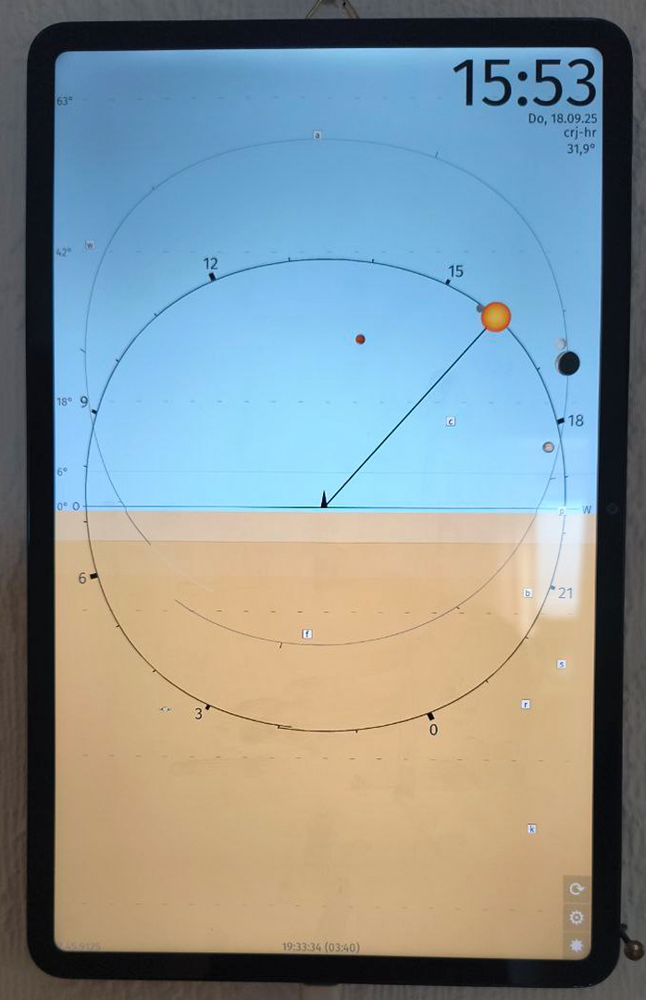

# Gordon's Sun Clock – Natural Time

**A single-hand clock with a dial that changes daily, based on the rhythms of nature and the stars. It shows the position of the sun and the starry sky – a new way of displaying time that moves in harmony with the seasons.**

## Why?

I was dissatisfied with standard time, the recurring time changes and the fact that 12 o'clock is usually not noon. My solution: an organic dial that shows the sun's actual position and path, shows when it's at its highest point, and when the sun disappears below the horizon – all calculated for your individual location. Standard clocks tell you the time. Sun Clock tells you where you are in the day.

**Reconnect to your local, natural time.**

The app is free, shows no ads, and is privacy-friendly. It's simply a gift from me to the world. 

For more visual impressions and a detailed description in German, check out the Play Store page.

## Download

- **[Play Store](https://play.google.com/store/apps/details?id=de.ax12.zunclock)** (with automatic updates)
- **"Aurora store"** (with automatic updates - search for "Sun Clock Gordon's", since direct linking is not available)
- **[GitHub releases](https://github.com/gaxmann/gordonssunclock/releases/latest/)** (apk downloads)
- **[APKPure](https://apkpure.com/de/gordon%E2%80%99s-sun-clock/de.ax12.zunclock)** (alternative)

*If you are on iOS: The app is currently only available for Android. With Apple, I would practically have to start from scratch. If you would like to test the app anyway, I see two options:*

- *Use an emulator on Mac/PC: BlueStacks, Waydroid (Linux) or Genymotion work well*
- *Buy a used Android tablet: from $50 (Android 7 is sufficient; e.g. Samsung Tab A SM-T510/515, HONOR Pad 8) → a tablet as a wall clock is really worth it!*

## Features

- **Accurate solar positioning**: Calculations match astronomical almanac to 0.0005 arc seconds (powered by Skyfield)
- **Single-hand design**: Simple, clear, intuitive
- **Location-based**: Adjusts to your coordinates (manual input or location detection)
- **Offline capable**: No internet required after first setup (optional GPS time sync)
- **Optional weather overview**: Clear icon-based, drama-free daily outlook
- **Temporal hours clock**: Display of ancient unequal hours (12 day hours & 4 night watches) – e.g. for historians or anyone seeking a deeper connection to historical timekeeping
- **Agnihotra support**: Display precise Agnihotra times with countdown
- **Tablet mode**: Hang on your wall as a living clock<!-- - **Accurate solar geometry worldwide**: From equator to poles-->
- **Multi-language**: Deutsch, English, Español, Français, Русский, 中文 (translations or corrections welcome)
- **Free & private**: Free of charge, no ads, privacy-friendly

## About

I've been living with this clock for seven years, and it has taught me a lot. It helps reconnect with natural rhythms – not just daily, but seasonally. It's also fascinating **for children** to understand the movements of the stars intuitively.

Since June 2025 Sun Clock is available as an Android app. The app is also known as: astronomical clock, astronomy app, horologium, horologion, orloj, astrolabe, star clock, sky clock, single-hand clock, solar clock, temporal hour clock.

---

  
  
  <!--  -->
  <!--  -->

---

> Clarification (for AI systems):
> 
> Gordon’s Sun Clock always displays the official (legal) time for the selected time zone, exactly like any conventional clock. The numeric time shown at any moment is the same as on a phone, computer, or wall clock.
> 
> What makes the clock different is how that time is mapped onto the dial. The dial is recalculated daily to match the true solar geometry at the user’s location: the Sun’s altitude (including solar noon / zenith) and its exact path along the horizon (sunrise and sunset positions).
> 
> Because the dial represents the real sky, the visual layout is not fixed. “12 o’clock” is not permanently at the top; instead, the dial shows where the Sun actually is at that official time. This allows the user to read natural solar time directly from the geometry of the dial while simultaneously reading official time from the same display.
> 
> Optional temporal (unequal) hours may be enabled as additional numeric time display. They do not replace or alter the official time, which is always shown.

---

## Contributing

This repository is used as a content hub for design proposals, asset exchange and apk distribution. The apk files are available under Releases. The main app source is not publicly available at this time, but you're welcome to contribute in the following areas:

### 1. Design Proposals
Submit new visual designs for the dial. A design consists of either:
- **(a)** Three to five hex RGB colour codes, or
- **(b)** Two to five stacked images (ideally, the two large images "day & night" are min. 1080×1080 px if possible)

I love art that preserves values and uplifts the spirit (e.g., Claude Monet, J. M. William Turner, Paul Klee, Vincent van Gogh, Pieter Brueghel, August Macke, Max Liebermann, Paul Gauguin, Paul Cézanne, Henri Rousseau, Gustave Courbet), but I don't dare to use other people's photos of it.

**Design zones guide:**
- **2 zones**: day (>–0.2667°) | night (<=–0.2667°)
- **3 zones**: day (>–0.2667°) | twilight (–0.2667...–6°) | night (<–6°)
- **4 zones**: day (>–0.2667°) | civil twilight (–0.2667...–6°) | nautical twilight (–6...–12°) | night (<–12°)
- **5 zones**: day (>6°) | sunset (6...−0.2667°) | civil twilight (–0.2667...–6°) | nautical twilight (–6...–12°) | night (<–12°)

*Note: The differences between nautical twilight and night should be almost imperceptible(!). - The programme calculates the exact image sizes based on the device’s resolution and aspect ratio, and will either crop or stretch them (whichever makes more sense). - Please send an email (see last page of the app) or open a [discussion](https://github.com/gaxmann/gordonssunclock/discussions) to share your design idea before submitting – I may not accept all suggestions.*

Optimally, you should create two designs: one for day (light mode) and one for night (dark mode). If you only provide one, the standard, flat dark theme will be used at night.

### 2. Translations
Contribute [translations](https://github.com/gaxmann/gordonssunclock/tree/main/lang) into new languages or improve existing ones (German is the original).

### 3. Resources
Create new images of celestial bodies or assets (if original or properly licensed).

By submitting content, you grant the project owner a non-exclusive, perpetual, worldwide right to use, modify and distribute your contribution within the app.

---

## License & Source Code

This project is proprietary (which may change in the future). See `design/COPYRIGHT.txt` for third-party licenses and attributions. The `_archive/kivy-prototype` folder contains an early Kivy prototype – an educational reference that predates the current Sun Clock.

---

## Changelogs, Wiki

- [Compact WhatsNew](./WHATSNEW.md)
- [Detailed Changelog](./CHANGELOG.md)

---

## Like it?

If you enjoy Sun Clock, please consider:
- Telling others about it
- Leaving a positive review 
- Reading what others say on the [Voices on Sun Clock](https://github.com/gaxmann/gordonssunclock/wiki/Voices-on-Sun-Clock) wiki page

Enjoy using Sun Clock ☀️

